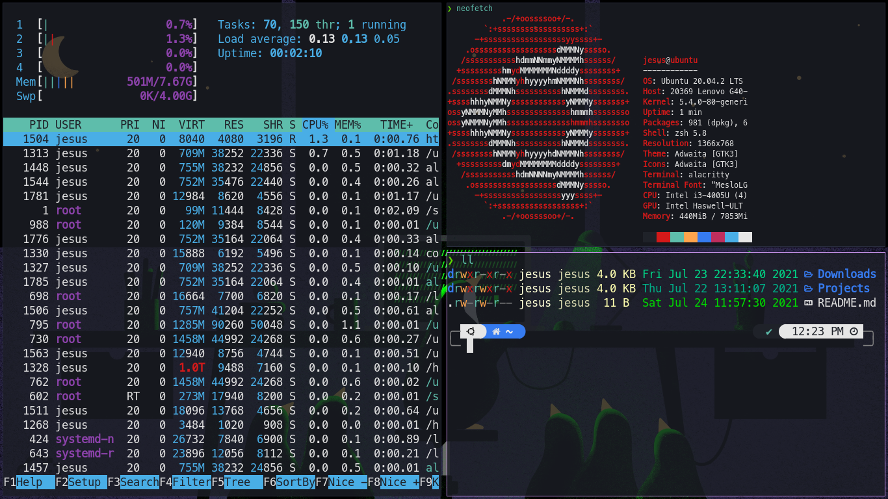

# dotfiles

My personal dotfiles for GNU/Linux systems



------

### Requirements 📦

| | |
|-|-|
| **Shell:** | <a href="https://www.zsh.org/"></a>   |
| **WM:** | <a href="https://xmonad.org/"></a> |
| **Editor:** | <a href="https://www.vim.org/"></a> |
| **Terminal:** | <a href="https://github.com/alacritty/alacritty"></a> |
| **Launcher:** | <a href="https://tools.suckless.org/dmenu/">dmenu<a/> |
| **Browser:** | <a href="https://www.mozilla.org/es-MX/firefox/new/"></a> |

-----
  
### Symbolic link example  🔗
  
```
ln -sf ~/dotfiles/.xinitrc ~/.xinitrc
```


